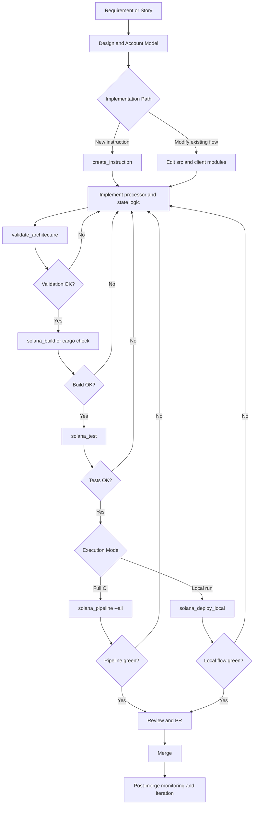
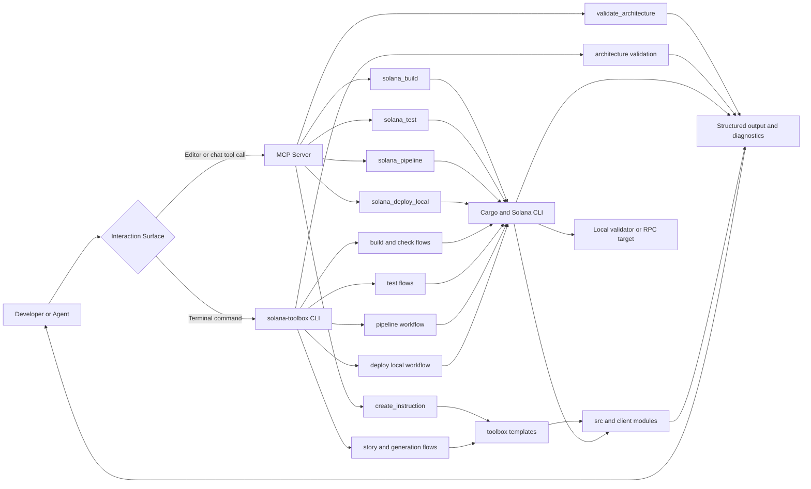

# Toolbox Architecture

## Overview

```
AI Agents (Copilot, Claude, Cursor)
         |
         v
MCP Server (JSON-RPC 2.0 over stdio)
         |
         v
Tools: solana_build, solana_test, solana_pipeline,
       solana_deploy_local, create_instruction,
       validate_architecture
         |
         v
Rust CLI + Templates
         |
         v
On-chain program + off-chain client
```

## Components

### MCP Server (`toolbox/mcp-server`)

- Protocol: JSON-RPC 2.0 over stdio
- Transport: async `tokio` stdin/stdout
- Registered tools:
  - `solana_build`
  - `solana_test`
  - `solana_pipeline`
  - `solana_deploy_local`
  - `create_instruction`
  - `validate_architecture`
- Purpose: expose deterministic development operations to AI agents

### CLI (`toolbox/cli`)

- Framework: `clap`
- Command surface mirrors toolbox workflows (build/test/validate/deploy/story/optimization)
- Purpose: human-friendly entrypoint for the same operational flows

### Templates (`toolbox/templates`)

- Instruction, processor handler, client builder, test, error variant, state struct templates
- Placeholder format: `{{PLACEHOLDER}}`
- Purpose: scaffold code that follows AGENTS.md patterns

## Interaction Flow

1. Developer starts from a story, requirement, or bug report.
2. Agent or developer invokes toolbox actions via CLI or MCP.
3. Code is scaffolded (`create_instruction`) and implemented in on-chain/off-chain layers.
4. Structural checks run with `validate_architecture`.
5. Build/test/deploy confidence is established via `solana_build`, `solana_test`, or `solana_pipeline`.
6. Local end-to-end execution uses `solana_deploy_local` or pipeline deploy/client steps.
7. Results are reviewed, refined, and merged when quality gates pass.

## Development Process Diagram



## Tool Interaction Diagram



## Runtime Layers

- On-chain layer (`src/`): instruction enum, processor handlers, state, errors, entrypoint.
- Off-chain layer (`client/`): instruction builders, transaction sender, RPC context, demo client.
- Network layer: local validator (`localhost`) or remote cluster.

## Key Principles

1. MCP-first: AI tools are first-class interfaces.
2. Template-driven consistency: predictable, reviewable codegen output.
3. Clear separation of concerns: on-chain core vs off-chain orchestration.
4. Validation by default: architecture checks alongside build/test.
5. Cross-platform operation: Windows, Linux, macOS.
